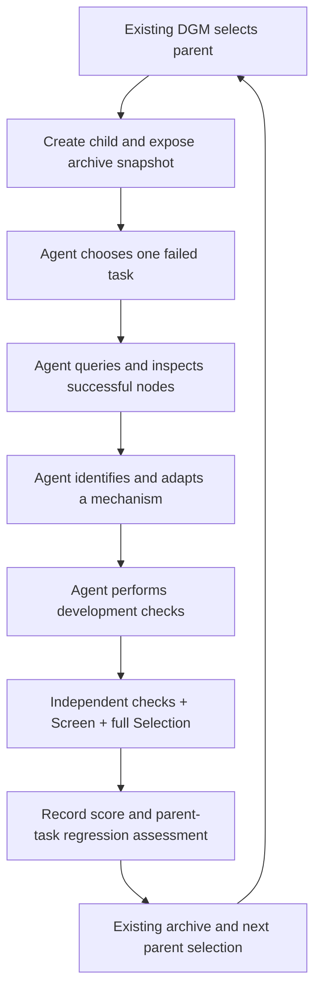

# Capability transfer inside the coding agent

Revised design plan · 2026-10-05 · branch `cap-transfer`

## 1. Recommended implementation

Extend the existing mutation workflow with archive access and capability-transfer instructions. **The coding agent chooses the failed task, retrieves successful children, compares their source and trajectories, identifies a useful mechanism, adapts it into its candidate, and performs development checks.**

The existing search controller continues selecting parents and scheduling children. Archive infrastructure supplies validated evidence and reconstructs donor implementations on request. The evaluator independently measures the child, and a separate assessment records target gains and parent-task regressions.

There is no separate consolidation controller, pinned current implementation, controller-selected target, or automatic donor-patch merge. For each mutation, “current implementation” means the selected parent's reconstructed source in the disposable candidate workspace. Different selected parents can benefit from other branches.

The first version adds exact-task archive lookup, source/evidence inspection helpers, an archive-aware mutation prompt, a public transfer report, and independent regression assessment. Comparisons of Hypothesis / Hypothesis + look-back / Look-back remain outside scope.

All new APIs, commands and configuration examples below are proposals. This revision changes only the design document.

## 2. Motivation and evidence

The [proposal](proposal.md) aims to recover capabilities fragmented across archive nodes while preserving the selected parent's strengths. The [mutation report](runs/experiments/artemis_sol_medium_50_20261002T181115Z/reports/codex_mutation_analysis.md) and [difficulty report](runs/experiments/artemis_sol_medium_50_20261002T181115Z/reports/node_task_difficulty_analysis.md) show complementary successes, regressions and repeated discovery of similar fixes.

During the original research, the saved [search state](runs/experiments/artemis_sol_medium_50_20261002T181115Z/attempt_005/state.json) contained 21 completed child lifecycles, a pending record for Child 22, and a best Selection score of 16/20 for Children 11 and 12. This is a dated observation, not a claim about current process activity. The union of recorded passes across completed scored candidates covered all 20 Selection tasks.

If Child 12 is selected as parent, its four recorded failures have these precedents:

| Parent failure | Successful precedents in the reported archive |
|---|---|
| AudioRecorderRecordAudioWithFileName | Child 4 |
| MarkorAddNoteHeader | Children 2, 3, 5, 11 |
| MarkorCreateNoteAndSms | Root, Children 7, 10 |
| RecipeAddMultipleRecipesFromMarkor | Children 4, 5, 14, 16 |

The agent should discover and investigate these precedents through archive lookup. A recorded success is a lead, not proof that a code difference caused it. Nearly equivalent clipboard patches passed and failed the same Screen seed in separate runs. Audio and note-header tasks also have recorded goal/validator discrepancies.

The goal is development-time adaptation of general harness mechanisms. It does not mean choosing a different harness per benchmark task at runtime, copying task answers, or guaranteeing that the archive's successes can be combined into 20/20.

## 3. Responsibility split

| Coding agent | Archive infrastructure | Controller and evaluator |
|---|---|---|
| Choose one unresolved task using the existing easiest-first policy | Supply compatible, authoritative task outcomes | Select the parent and create the child |
| Query successful nodes and choose donors to inspect | Filter invalid and held-out evidence; expose provenance | Freeze the archive view for the mutation |
| Compare behavior, source, prompts and public repair claims | Reconstruct full donor source and scoped trajectories | Capture the patch and enforce protected paths |
| Identify and adapt a mechanism | Generate mechanical diffs and evidence manifests | Run engineering checks and independent Screen/Selection |
| Choose focused and related regression checks | Record helper requests and artifact hashes | Measure gains, preservation and regressions |
| Explain development results and uncertainty | Preserve immutable artifacts | Record whether the transfer was independently demonstrated |

The agent owns the substantive decisions. A lookup helper can sort matching donors deterministically for convenience, but it does not decide which donor or mechanism the agent must use. Independent assessment does not trust agent claims as benchmark evidence.



## 4. Repository integration

| Existing component | Proposed change |
|---|---|
| [core/contracts.py](alpha_agents/tree_search/core/contracts.py) | Keep existing mutation/evaluation contracts; add optional archive context metadata |
| [core/controller.py](alpha_agents/tree_search/core/controller.py) | Pass a frozen archive descriptor into preparation; preserve selection and lifecycle |
| [core/workspace.py](alpha_agents/tree_search/core/workspace.py) | Factor out full donor reconstruction; exclude archive bundles from patches and descendants |
| [core/storage.py](alpha_agents/tree_search/core/storage.py) | Persist snapshot identities, helper logs, reports and assessments |
| [AndroidWorld bridge](alpha_agents/tree_search/bridges/androidworld/bridge.py) | Expose task profiles and compare independent child/parent outcomes |
| [artemis.py](alpha_agents/tree_search/bridges/androidworld/artemis.py) | Add archive-helper instructions and derived episode-seed validation |
| [benchmark.py](alpha_agents/tree_search/bridges/androidworld/benchmark.py) | Reuse fingerprint fields for archive compatibility and optional replay |
| [Codex prompt](alpha_agents/tree_search/mutators/coding_agents/codex/prompt.md) | Add retrieval, comparison and preservation instructions; retain agent-selected targets |

Proposed support modules:

```text
archive/
  catalog.py          # settled records, compatibility, snapshots
  reconstruction.py   # baseline + ancestor patches -> donor source
  cli.py              # query, inspect, export and compare
  tests/
bridges/androidworld/
  archive.py          # task normalization and scoped evidence export
  transfer_assessment.py
mutators/coding_agents/codex/
  transfer_prompt.md
```

No new controller or duplicate candidate lifecycle is needed. Compose an archive provider through the CLI and expose its descriptor through `MutationContext.evidence`. Add a narrow preparation-context hook in the existing lifecycle. Generic code must not import AndroidWorld or a model SDK; task semantics and SQLite exports belong to the bridge.

Important existing semantics:

- A donor's last patch is relative to its parent. Its useful mechanism may come from ancestors.
- `keep_better` compares against the initial score minus tolerance; retained candidates remain selectable. It does not enforce parent-task preservation.
- Validator failures mark candidates diagnostic rather than preventing archive admission.
- Artemis ranks reward greater than 0.5 as a pass; partial rewards remain separate.
- Recognized bounded agent failures are zeros; invalid runtime results do not establish task failure.
- Check each episode's derived seed before paired comparisons, beyond the current stage-level base-seed check.
- Sanitize parent-evidence copying once candidate directories contain archive contexts or historical report paths.

## 5. Validated archive catalog

Index settled official Selection outcomes from candidate records and normalized worker manifests. Check expected episodes, process completion, derived seeds and evaluated patch identity. Do not use Markdown reports or historical benchmark-manifest success columns as the database.

Each entry contains a namespaced candidate reference, lineage, reconstructed source identity, task/stage/instance/base-seed/derived-seed, effective score, raw reward, ranked pass, outcome class, failure kind and evidence references. Include trajectory/image availability and artifact hashes. A child ID alone is not unique across runs.

Keep source identity separate from evaluation compatibility: donor sources necessarily differ. Compatibility includes evaluator/task revisions, runtime/model settings, dependencies, budgets and fixture identity. Reuse relevant `cache_identity()` fields without requiring identical agent hashes or exposing held-out outcomes.

Distinguish pass, partial, normal zero, bounded agent failure, invalid runtime, pending and not run. Initially qualify donors using complete scored candidates with authoritative compatible Selection passes. Screen and focused-development successes are supplemental evidence, not equivalent donors.

At each child dispatch, freeze a catalog of settled eligible candidates from archive, retained and diagnostic pools. Include lower-scoring nodes when their outcomes qualify. Record the snapshot in the pending record and mutation context. A resumed mutation must see the same catalog, even if other children settle later.

Optional cross-run import copies validated baseline/lineage and allowlisted evidence into an archive store, verifying hashes before and after copying. Ignore pending artifacts. Reconstruct from immutable source and patches, never evaluator-modified live worktrees. Use finalized trajectories or a consistent SQLite backup that accounts for WAL contents.

## 6. Agent-facing archive access

Expose trusted local commands through the agent's existing command-execution capability. Version one does not need a new SDK tool or MCP server. Context supplies the helper's absolute path, frozen catalog descriptor and allowed export directory.

Proposed interface:

```text
archive-helper query --catalog <snapshot> --task <task-name>
archive-helper inspect --catalog <snapshot> --node <run/node>
archive-helper export --catalog <snapshot> --node <run/node> --task <task-name> --output <assigned-export>
archive-helper compare --catalog <snapshot> --parent <run/node> --donor <run/node> --output <assigned-export>
```

Queries return all eligible donors with deterministic ordering and optional pagination. Show target-instance success, repeated observations where available, evidence quality, whole-node score and observed overlap/losses against the parent. The coding agent decides what to inspect and use; do not truncate discovery to a controller-selected list.

Exports reconstruct complete source and task-scoped execution evidence. Comparisons distinguish a whole-version diff from the donor's final-edge patch. Resolve IDs through the catalog, validate export locations and publish atomically. Log requests outside tracked harness source.

```text
.dgm_archive/
  catalog.json
  parent_profile.json
  exports/<run>/<node>/
    source/
    task/<task-name>/
    parent_to_donor.diff
    donor_mutation.diff
    lineage.json
    manifest.json
```

Source includes prompts, execution configuration and Artemis preserved-module mappings/backing files. Associate trajectories with exact goals, sessions, seeds and execution order. Provide scoped SQLite rows or finalized traces, screenshots, action outcomes and public repair summaries. Label missing images or ambiguous associations. Previous hypotheses are claims with evidence references, not causal proof or private reasoning.

Exclude Confirmation, full audits/caches and raw historical conversations that may contain held-out results. The catalog exposes allowed Selection outcomes; trajectory exports are scoped to requested tasks. Exclude archive directories from Git capture, descendant reconstruction and future parent-evidence copying. Check bundle integrity before/after mutation.

The full-access mutator means these checks are not OS isolation. Stage only intended evidence and avoid exposing held-out paths. If enforced separation is required, use an explicit process/container boundary rather than treating prompts or ignored directories as a sandbox.

## 7. Revised coding-agent workflow

Extend the existing one-task, easiest-first mutation instructions:

1. **Choose the task.** Inspect the parent's Selection results, select an unresolved task using difficulty and expected human steps, and explain the choice before editing. Keep it fixed for this mutation.
2. **Retrieve precedents.** Query archive successes. Inspect several donors as useful, selecting by provenance, compatibility and behavioral differences rather than aggregate score alone.
3. **Compare behavior and implementation.** Inspect current failure and donor success trajectories, screenshots, actions, code, prompts and public repair records. Identify where behavior diverges.
4. **Identify a mechanism.** Explain the general capability, dependencies, alternative explanations and uncertainty. Blind patch application or whole-node replacement is insufficient.
5. **Integrate.** Adapt the smallest coherent mechanism into the candidate while preserving behavior needed by tasks the parent already solves.
6. **Validate.** Run meaningful component checks and a representative target experiment. Choose related regression tests based on the changed mechanism. Replay donors when ambiguous evidence makes it useful and budget permits.
7. **Report.** Record target, donor references, cited evidence, mechanism, changes, commands/results and uncertainty. Independent evaluation follows.

The agent chooses donors, replay and development checks within its assigned resources and mutation budget. The bridge's example experiment command must be adaptable to the agent-selected task; it must not prescribe a conflicting target. No separate outer target-selection policy is introduced.

If no donor succeeds, document the coverage gap and continue the existing general repair workflow for the same task. Archive access augments mutation rather than preventing work without a precedent. If donor successes remain unexplained or cannot support a general repair, report that and investigate within budget; do not invent a task-specific compensation.

Minimal means coherent behavior with required dependencies, not minimum changed lines. Component tests should exercise the mechanism and counterexamples. Do not add fixed goal branches, answer lookups, filenames/coordinates, evaluator edits or validator-specific compensation. A successful donor is not permission to change the benchmark.

Keep donor replay separate from historical official outcomes. Preserve every development attempt, distinguish infrastructure-invalid results from legitimate zeros, and avoid repeatedly rerunning a zero merely to obtain a pass.

## 8. Transfer report and independent regression assessment

Write a proposed `transfer_report.json` outside tracked source:

```json
{
  "schema": 1,
  "parent": "run/child_000012",
  "archive_snapshot": "<digest>",
  "target_task": "<agent-chosen-task>",
  "donors_inspected": ["run/child_000004"],
  "donors_used": ["run/child_000004"],
  "mechanism": "<general behavior adapted>",
  "evidence": ["<bundle-relative references>"],
  "changed_files": ["<paths>"],
  "development_checks": [],
  "remaining_uncertainty": []
}
```

Validate it against catalog entries, helper requests and captured patch. Agent-written provenance is a claim; corroborate it with exported identities and observed requests. Missing or invalid reports do not erase a legitimate independent score, but prevent claiming a documented transfer.

After engineering checks, Screen and full canonical Selection, compute:

- Target gained: parent target was unresolved and child target passes.
- Retained parent passes: intersection of solved-task sets.
- Regressions: parent pass becomes child nonpass.
- Additional gains: other parent nonpasses become passes.
- Partial losses: effective reward decreases, separately reported.
- Validity: compatible contracts/sources, paired seeds and complete outcomes.

Write `transfer_assessment.json` with `demonstrated`, `not_demonstrated` or `incomplete`, reason codes and evidence. Demonstrated transfer requires a validated claimed target gain, no lost parent full passes, and successful independent required checks. Preserving partial rewards is an optional stricter condition; losses remain visible regardless. This is observed preservation on the declared panel, not proof of causality or statistical reliability.

The canonical denominator remains 20. Subset development results do not enter ranking. Validate the runner's seed mapping, `SHA256(base_seed + '_' + task_name + '_' + index) mod 2^32`, retaining task identity across subset/full execution. Bounded agent failures remain zeros; invalid/ungraded results make comparisons incomplete.

Separate worker/goal status, benchmark score and transfer assessment. A blocked goal or normal worker exit is not target success; an increased score while the target still fails is not demonstrated transfer.

**Version one records assessment without changing DGM admission or parent selection.** A regressing candidate remains evidence but is labelled as failing preservation. A future strict eligibility policy needs its own explicit specification covering archive, retained and diagnostic pools and final selection. Changing only archive admission would not prevent rejected candidates from being selected elsewhere.

## 9. Verification budget and held-out evaluation

Default outer verification remains the existing Screen plus full Selection: 25 official episodes per child that passes Screen. The agent chooses focused and related development checks within its mutation budget. The previous design's mandatory 59-episode panel is removed.

Optionally configure a predeclared fresh paired Selection panel for the target plus all parent-solved/partially rewarded tasks, running both parent and child. Report these separately from canonical score. With 16 parent passes and one target, this adds 34 episodes, totaling 59. It should be explicit, not enabled opportunistically after observing a failure.

At a 1,800-second task cap, 25 episodes use at most 12.5 device-hours and 59 use at most 29.5, excluding development, replay, setup and imbalance. These are upper bounds. Record mutation time, device-seconds, archive storage/helper costs and available model telemetry. Missing budget for a declared required check means incomplete evidence.

Confirmation remains outside archive queries, context and all development checks. Final held-out evaluation follows the existing terminal audit workflow. If the existing search chooses a scalar-score winner, report its measured preservation status rather than automatically calling it consolidated. Pauses and later continuations must not expose new held-out results to repair.

## 10. Persistence and existing runs

Use existing run locks, state, candidate records and atomic storage. Add archive configuration/provider identity to the resume contract. Persist each child's snapshot before mutation, then helper logs, exports, report and assessment in its artifact directory.

There is no separate transfer controller state, accepted chain or current-candidate pointer. Resume preserves the original archive view and validated settled artifacts. Export and assessment publication must be idempotent; a crash between evaluation and assessment should not rerun a settled benchmark or substitute new donors.

Do not alter the existing experiment to insert changed bridge/mutator settings. Start a new archive-enabled run importing compatible settled evidence. Reconstruct Child 12 as an initial harness only if explicitly chosen for that experiment; the architecture does not require it. Normal source initialization and parent selection remain available.

## 11. Proposed configuration

Keep existing search settings and add opt-in support:

```json
{
  "archive_access": {
    "enabled": true,
    "import_runs": ["../existing-experiment/attempt_005"],
    "include_current_run": true,
    "allowed_stages": ["selection"],
    "compatibility": "exact_evaluation_contract"
  },
  "mutation": {
    "type": "codex",
    "prompt_template": "../mutators/coding_agents/codex/transfer_prompt.md"
  },
  "transfer_assessment": {
    "enabled": true,
    "require_parent_pass_preservation": true,
    "require_partial_reward_preservation": false,
    "fresh_selection_base_seeds": [],
    "affect_search_admission": false
  }
}
```

This is a fragment, not a runnable experiment config. “Require” defines the demonstrated-transfer label; it does not override admission. Implement admission overrides only after specifying a separate policy. Resolve import and prompt paths relative to configuration files and include feature identities in resume validation.

Disabled archive support preserves existing behavior. Reuse mutation model/effort and assigned devices. Archive lookup does not require extra credentials or concurrent coding agents.

## 12. Implementation milestones

### Milestone 1: Catalog and source reconstruction

Implement validated indexing, compatibility, namespace/provenance records, frozen snapshots, donor reconstruction and inspection commands.

Acceptance: a pinned experiment snapshot reproduces the 20-task coverage union and Child 12 failures; pending/invalid outcomes never qualify as donor passes; ancestry and preserved modules reconstruct correctly; held-out artifacts are absent. Test ID collisions, wrong episode seeds, incompatible contracts, missing evidence and atomic exports.

### Milestone 2: Existing mutation-context integration

Compose the provider, pass catalog descriptors through existing preparation, and revise the prompt. A fake backend should see archive access and parent outcomes without a controller-prescribed target or donor.

Acceptance: exports work after resume, archive files never enter patches or descendants, and inherited donor mechanisms remain visible even when the donor's last patch did not introduce them. The existing parent-selection algorithm and mutation lifecycle remain unchanged.

### Milestone 3: Reports and independent assessment

Corroborate public transfer reports and compute official paired gains/losses while preserving legitimate scores and admission semantics.

Acceptance: tests distinguish target gain with preservation, higher aggregate score with regressions, failed target, partial losses, failed required checks, blocked goals, invalid reports and incomplete parent/child evaluation. Missing parent Selection means incomplete preservation assessment, not invented failures. Test crashes at snapshot/export, mutation, evaluation and assessment publication. Existing DGM and generic import-boundary tests must pass.

### Milestone 4: One real archive-assisted mutation

Use a new run and assigned devices. The coding agent selects the task, queries and inspects donors, attempts a general integration and runs its checks; independent evaluation follows normally.

Acceptance: inspect actual helper requests, source/patch identities, chosen task, donor evidence, screenshots, development results, official target grade, parent-task comparison and cleanup. Exposing a catalog alone is insufficient; the observed mutation must actually use donor evidence. An unsuccessful repair validates plumbing but does not establish effective transfer.

### Milestone 5: Multiple mutations and generalization

Run normal search with archive-aware coding agents. Report retrieval/use rates, adapted mechanisms, target gains, retained/lost passes, unsuccessful repeats and cost. Stronger implementations can accumulate mechanisms through ordinary search ancestry.

After development ends, compare held-out baseline/winner results under the same contract. Assess whether agent-level archive access improves transferable harness behavior; the deferred strategy comparison is not required.

## 13. Research basis

These sources informed the original research. Placing retrieval inside the coding agent is the revised architectural recommendation:

- Reuse DGM's archive and empirically evaluated mutation lifecycle. [Darwin Gödel Machine](https://arxiv.org/html/2505.22954v2).
- Preserve diverse strengths beyond scalar score; this design does not implement MAP-Elites cells. [Illuminating search spaces by mapping elites](https://arxiv.org/abs/1504.04909).
- Retrieve and adapt existing code, without assuming GUI success identifies a causal fragment. [Revisiting ssFix for Better Program Repair](https://arxiv.org/abs/1903.04583).
- Learn from successful trajectories, using them here for development-time changes rather than runtime workflow injection. [Agent Workflow Memory](https://arxiv.org/abs/2409.07429).
- Assess generalization independently of repair evidence; preserve Confirmation. [Is the Cure Worse than the Disease? Overfitting in Automated Program Repair](https://people.cs.umass.edu/~brun/pubs.php?bib=pubs/brun.bib&key=Smith15fse).

The first implementation makes archived successes accessible and useful to the coding agent, then measures whether its integrations gain capabilities while preserving the parent's behavior.
