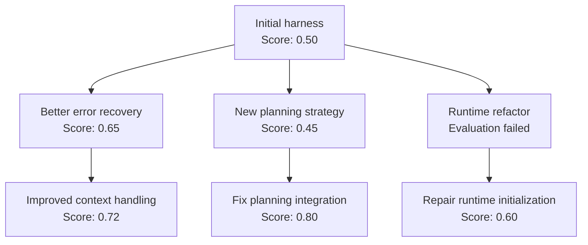

# DGM tree search algorithm

This guide explains the algorithm implemented in this repository. The authoritative implementation is [controller.py](core/controller.py), with shared interfaces in [contracts.py](core/contracts.py) and candidate reconstruction in [workspace.py](core/workspace.py).

DGM searches over versions of a harness. Each node is a candidate implementation, and each edge is a code change produced from a parent candidate. The search repeatedly chooses a version, modifies it, evaluates it, and preserves the result so later attempts can build on it.

## 1. The search tree



A useful search can revisit several branches. The planning change initially performs worse, but a later improvement makes that branch the strongest. The failed runtime evaluation also supplies evidence for a repair.

This motivates preserving more than the current highest-scoring candidate. Each candidate has exactly one parent, while a parent can produce many children.

## 2. What a node represents

| Field | Meaning |
| --- | --- |
| ID | Unique candidate name within the run |
| Parent ID | Candidate from which this version was derived |
| Workspace | Reconstructed harness source |
| Base commit | Git revision before this candidate's mutation |
| Patch | Changes introduced by this candidate |
| Evaluation | Score, status, metrics, and evidence |
| Mutation record | Whether the editing backend finished successfully |

The searchable object is the harness source. Depending on the harness, a mutation could change planning logic, prompts, tool handling, memory retrieval, retries, parsing, or execution workflows.

The default implementation stores improvements as code patches. It does not automatically update model weights.

## 3. Establish the root candidate

Before generating mutations, the controller:

1. Copies the supplied harness into a source snapshot.
2. Creates the `initial` candidate from that snapshot.
3. Acquires an execution resource through the bridge.
4. Evaluates the initial harness.
5. Saves the result and a checkpoint.

If the initial harness completes 10 of 20 tasks, its score is:

```text
baseline_score = 10 / 20 = 0.50
```

The bridge defines how to measure performance. Completed evaluations must return a finite score between `0` and `1`, with higher scores meaning better performance. For latency, cost, or other metrics, the bridge must normalize the metric and account for whether higher or lower values are better.

If baseline evaluation fails, its score remains absent. The controller can still preserve the root as a diagnostic parent, allowing a mutation to investigate and repair the failure.

## 4. Select a parent to expand

The controller builds the eligible parent pool from the union of:

- The scored archive.
- Retained candidates.
- Diagnostic candidates.

Duplicate IDs are removed because a candidate can belong to more than one pool.

### Selection strategies

| Strategy | Behavior |
| --- | --- |
| `random` | Every eligible parent has equal probability |
| `best` | Select the parent with the highest recorded score |
| `score_prop` | Sample parents using a score-based weight |
| `score_child_prop` | Use the score weight, then reduce it for parents with many recorded children |

`best` concentrates attempts around the current strongest candidate. `random` spreads attempts broadly. The default, `score_child_prop`, balances measured performance with opportunities to explore less-expanded candidates.

### Score-based weights

For candidate `i`, let `s_i` be its score. The implementation transforms the score into a sigmoid weight:

```text
q_i = 1 / (1 + exp(-10 * (s_i - 0.5)))
```

This sigmoid is centered at `0.5`. Low scores have small positive weights; high scores have large weights.

For `score_prop`, the probability is:

```text
P(i) = q_i / sum(q_j for every eligible candidate j)
```

For `score_child_prop`, let `n_i` be the number of recorded direct children of candidate `i`:

```text
w_i = q_i / (1 + n_i)
P(i) = w_i / sum(w_j for every eligible candidate j)
```

Example:

| Parent | Score | Recorded children | Adjusted weight | Selection probability |
| --- | ---: | ---: | ---: | ---: |
| A | 0.80 | 5 | 0.159 | 13.7% |
| B | 0.60 | 0 | 0.731 | 63.1% |
| C | 0.40 | 0 | 0.269 | 23.2% |

Although A has the highest score, it has already received several attempts. B gets more opportunity to produce an improvement.

Recorded child counts include failed attempts. Pending attempts are not counted until their records are admitted. Parent sampling is repeated for each attempt, so the same parent may be selected multiple times in a batch.

A failed evaluation uses `0` only when calculating selection weights. Its stored evaluation still has no score.

These formulas are heuristics; they do not estimate the probability that a parent will produce an improvement.

## 5. Reconstruct the parent's implementation

Suppose the selected parent has this lineage:

```text
initial -> A -> B
```

To create a child of B, the workspace code:

1. Copies the original source snapshot.
2. Applies A's patch.
3. Applies B's patch.
4. Commits the reconstructed parent version.
5. Copies B's evaluation evidence into an ignored evidence directory.

The mutation backend receives B's implementation and evidence.

Evaluation can create logs, caches, or other changes in a candidate workspace. Descendants inherit the saved source patches, so evaluator side effects do not accidentally become inherited code.

The child's patch is measured relative to B's reconstructed implementation. It contains only the new mutation. Ancestor patches are applied in lineage order when reconstructing descendants.

## 6. Generate a mutation

The bridge supplies a `MutationContext` containing:

- The improvement objective.
- Harness-specific instructions.
- Parent evidence.
- Protected file patterns, when configured.

The mutation backend edits the candidate. With Codex, the backend can inspect code and evidence, investigate a failure, make changes, and perform checks. With a command backend, another editing process performs the work.

Conceptually:

```text
child_harness = Mutate(parent_harness, parent_evidence, bridge_instructions)
```

The editing backend proposes the code changes. The controller chooses which implementation to expand and manages the resulting candidate.

After mutation, the controller captures the Git diff, including newly created files, and checks:

1. Was a nonempty patch produced?
2. Did the patch change protected files?

An empty patch or a protected-file edit becomes a `mutation_failed` attempt and does not enter the eligible parent pools. The attempt's record and artifacts remain available for inspection.

## 7. Independently evaluate the child

A permitted, nonempty patch receives evaluation through the bridge:

```text
evaluation = Evaluate(child_harness)
```

The mutation backend's claims and local checks do not determine the score. The independent evaluator does.

A completed evaluation might return:

```json
{
  "status": "completed",
  "score": 0.75,
  "metrics": {
    "passed": 15,
    "total": 20
  }
}
```

A runtime failure might return:

```json
{
  "status": "failed",
  "error": "Environment initialization failed"
}
```

The failed result has no score. A valid score of `0` means the benchmark ran successfully and the candidate solved none of its tasks. Evaluation failure means performance was not established.

The controller also evaluates a partial patch if the mutation backend times out or fails after making changes. A valid evaluation can establish its performance, while the interrupted mutation remains diagnostic evidence.

In AndroidWorld, every scored candidate uses the same configured task split. This keeps scores comparable across the tree.

## 8. Preserve results in the parent pools

Every attempt gets a permanent candidate record. Eligibility for future expansion depends on its result.

| Pool | Purpose |
| --- | --- |
| Scored archive | Valid evaluations accepted by the archive policy |
| Retained pool | Valid evaluations below the archive threshold |
| Diagnostic pool | Evaluation failures or candidates with diagnostic flags |

The pools can overlap. A candidate can receive a valid score and enter the archive while also carrying a diagnostic flag because its editing process was interrupted.

### Archive policies

With `keep_all`, every valid evaluated candidate enters the scored archive.

With `keep_better`, admission requires:

```text
child_score >= initial_score - score_tolerance
```

For a baseline score of `0.60` and tolerance of `0.10`, the threshold is `0.50`. If the baseline has no valid score, a valid child is accepted without that comparison.

The current threshold compares against the initial baseline. It does not require improvement over the parent or the current best candidate.

A valid candidate below the threshold enters the retained pool, which remains selectable. Therefore, `keep_better` changes archive membership; it does not prune all lower-scoring branches from the search.

This permits a sequence such as:

```text
Initial: 0.50
    -> Planning change: 0.45
        -> Integration repair: 0.80
```

An intermediate version may contain a useful idea that needs another change before its benefit appears in the benchmark.

## 9. Schedule the search

### Synchronous scheduling

The controller selects a batch of parents from the current pool, launches their mutations, and waits for the entire batch to finish before selecting another batch.

```text
Select two parents
    -> Run child A and child B
    -> Save both results
    -> Select the next two parents
```

A's result cannot influence another parent selection within the already-selected batch. Results are admitted as they finish, but the next batch is selected only after all current attempts finish.

### Asynchronous scheduling

The controller fills available worker slots. When a child finishes, it admits that result and selects another parent for the available slot.

```text
Run A and B
    -> A finishes
    -> Admit A
    -> Select and launch C while B continues
```

C can descend from A.

Asynchronous scheduling keeps workers occupied when evaluation times differ. Completion order affects which parents are available at each selection, so a fixed random seed alone does not guarantee the same asynchronous tree.

### Workers and resource leases

Worker count and execution resources are separate limits. Four controller workers with two device leases can have only two candidates holding devices at once.

The bridge manages those resources. A lease spans preparation, mutation, and evaluation, and is returned when the candidate lifecycle exits.

## 10. Stop and resume

The main stopping condition is `max_children`: the total number of child attempts.

The baseline does not consume a child attempt. Failed mutations and failed evaluations do count toward the budget.

The controller checkpoints:

- Candidate records and lineage.
- Archive, retained, and diagnostic pools.
- Pending attempts.
- Completed attempt count.
- Random generator state.
- Run configuration and source fingerprint.

On resume, it checks that the run contract matches and the source snapshot has not changed. The child budget may increase, but cannot shrink.

If an interrupted child already has a saved result, that result is recovered. Otherwise, its available patch and evidence are preserved as a diagnostic candidate, subject to protected-file checks. Interrupted initial setup can also resume, preserving incomplete baseline directories before retrying initialization.

The controller returns the complete search state. It does not automatically deploy a candidate or export a single winner. Choosing the highest-scoring valid candidate is a separate downstream step.

## 11. Complete loop

The following pseudocode describes one attempt; the scheduler runs attempts in batches or concurrently:

```python
evaluate_initial_harness()

while child_attempts < budget:
    parent = select_parent(eligible_candidates)
    child = reconstruct_parent_and_create_workspace(parent)

    with bridge.lease() as resource:
        context = bridge.prepare(child, parent, resource)
        mutation_backend.mutate(child, context)

        patch = capture_changes(child)

        if patch_is_empty_or_changes_protected_files:
            record_mutation_failure(child)
        else:
            run_optional_validators(child)
            evaluation = bridge.evaluate(child, resource)
            update_parent_pools(child, evaluation)

    checkpoint()
```

The implementation additionally records mutation exceptions and independently evaluates permitted partial patches after mutation failure.

## 12. What tree search means here

The tree represents implementation ancestry. Expanding a node means generating another code mutation from that version.

This implementation uses archive-based evolutionary search. Immediate evaluation scores and expansion counts guide parent selection. It has no descendant-value estimate, rollout simulation, or reward backpropagation.

If A scores `0.40` and its descendant B scores `0.90`, A's recorded score stays `0.40`. B becomes an attractive parent because of B's own result.

## 13. Separation of responsibilities

| Component | Responsibility |
| --- | --- |
| DGM controller | Parent selection, scheduling, archives, attempt lifecycle, and resume |
| Harness bridge | Mutation context, resource ownership, task semantics, scoring, and evaluation |
| Mutation backend | Code editing and mutation execution evidence |
| Optional validators | Regression checks |
| Actual harness | Agent and runtime code that executes the tasks being measured |

The controller works through the common bridge contract. AndroidWorld, a coding benchmark, a browser agent, or another harness can implement that contract without adding benchmark-specific rules to the search algorithm.

## 14. Current defaults

| Setting | Default |
| --- | --- |
| Child-attempt budget | `20` |
| Workers | `1` |
| Scheduling | `synchronous` |
| Batch size | `2` |
| Parent selection | `score_child_prop` |
| Archive policy | `keep_all` |
| Score tolerance | `0.1` |
| Random seed | `42` |

These are implementation defaults, not empirically established optimal settings. Their effects depend on mutation quality, evaluation cost, benchmark noise, and how useful intermediate candidates are as parents.
